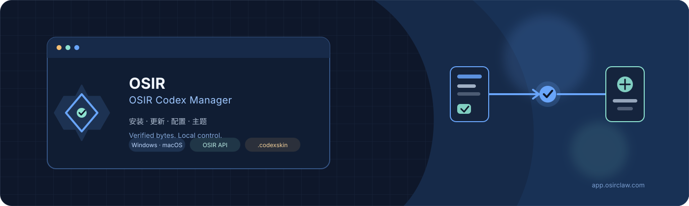
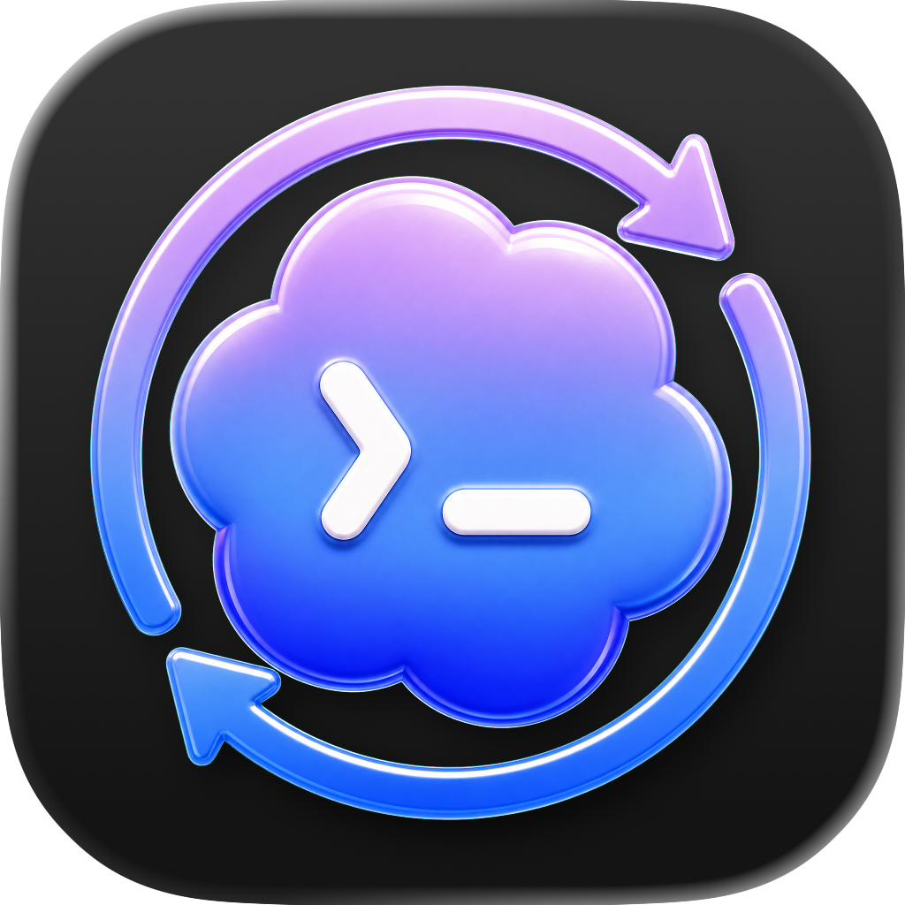

<p align="center">
  
</p>

<p align="center">
  
</p>

<h1 align="center">AWAI Codex App Manager</h1>

<p align="center">
  一个面向 Windows 和 macOS 的 Codex 桌面应用管理器：安装、更新、配置、卸载和主题管理。<br>
  An AWAI desktop manager for installing, updating, configuring, uninstalling, and theming Codex.
</p>

<p align="center">
  <a href="https://codexapp.awai.cc">下载镜像</a> ·
  <a href="https://api.awai.cc">AWAI API</a> ·
  <a href="https://github.com/qq501987847/codex-app-manager-skins">AWAI 皮肤库</a> ·
  <a href="docs/code-signing-policy.md">代码签名政策</a>
</p>

## 项目定位

AWAI Codex App Manager 只负责本地管理体验，不修改 Codex 应用包，也不绕过
OpenAI 或 Microsoft 的安装策略。Codex 官方安装包通过 `codexapp.awai.cc` 分发，
下载后仍由 Windows MSIX 签名、macOS Developer ID / Sparkle 签名和 SHA-256 校验
共同确认完整性。

Manager 自身使用 Tauri updater 更新。Manager 更新包、Codex 安装包和 AWAI API
配置是三条独立链路，不会把 API Key 写入皮肤包或上传到镜像服务器。

## 功能

- 检测已安装的 Codex，规划安装、更新和卸载操作。
- Windows 优先使用官方 MSIX，必要时提供经过校验的便携回退。
- macOS 使用官方 Sparkle appcast 和增量更新包，失败时回退完整包。
- 左侧 `CODEX 配置管理`：API Key、Base URL、模型、人格、Goal Mode、响应存储和安全策略。
- AWAI 默认入口：`https://api.awai.cc`。用户可以在配置页改为其他兼容 OpenAI 的地址。
- AWAI 皮肤库：在线安装、导入、试穿、应用和恢复，不修改 Codex 安装文件。
- 浏览器开发预览：不启动 Tauri 时也可以先验证布局和状态。

## 下载

最新镜像地址：<https://codexapp.awai.cc>

| 平台 | 文件 |
| --- | --- |
| Windows x64 | `https://codexapp.awai.cc/manager/latest/CodexAppManager_x64-setup.exe` |
| Windows ARM64 | `https://codexapp.awai.cc/manager/latest/CodexAppManager_arm64-setup.exe` |
| macOS Apple Silicon | `https://codexapp.awai.cc/manager/latest/CodexAppManager_aarch64.dmg` |
| macOS Intel | `https://codexapp.awai.cc/manager/latest/CodexAppManager_x86_64.dmg` |

Windows 当前版本可能仍显示 SmartScreen 未知发布者，因为 Authenticode 证书尚未
接入。请先核对同一版本的 `SHA256SUMS`，不要把 Tauri updater 签名误认为 Windows
发行者签名。测试安装包和预发布版本应标记为测试，不应冒充稳定版本。

## AWAI 镜像

`codexapp.awai.cc` 是本项目的下载服务器，当前提供：

- `/latest/manifest`、`/latest/checksums`：Windows 当前版本元数据。
- `/latest/win-x64`、`/latest/win-arm64`：官方 MSIX 字节镜像。
- `/latest/appcast.xml`、`/latest/appcast-x64.xml`：macOS Sparkle feed。
- `/manager/latest.json` 和 `/manager/*`：Manager 自更新元数据和安装包。

服务器使用 Caddy 自动申请和续期 HTTPS 证书。同步脚本从上游获取当前官方包，
在发布前保留原始签名和校验值：

```bash
bash deploy/download-server/bootstrap.sh codexapp.awai.cc
bash deploy/download-server/sync-current-mirror.sh
```

当前历史版本选择器仍通过受保护的上游 Release API 获取历史清单；后续兼容 API
完成后会迁移到 AWAI 镜像，安装校验规则不会放宽。

## 本地开发

```bash
npm install
npm run check
npm test
npm run tauri:dev
```

构建 Windows NSIS 安装器：

```bash
npm run tauri build -- --bundles nsis --target x86_64-pc-windows-msvc
```

本地构建默认未配置 Authenticode。正式发布前还需要配置 Tauri updater 私钥、
macOS Developer ID / 公证，以及 Windows 代码签名服务（如果不接受未签名发布）。

## 皮肤

AWAI 皮肤库位于：

- GitHub: <https://github.com/qq501987847/codex-app-manager-skins>
- Gitee: <https://gitee.com/qq501987849/codex-app-manager-skins>

皮肤只负责视觉样式和背景图片，不包含品牌推广、API 地址、API Key 或模型配置。
背景图必须是自己生成、自己拍摄或明确获得授权的素材。MIT 只覆盖软件代码，
不会自动覆盖第三方人物图或其他艺术素材。

## 安全边界

- Manager 不会修改 Codex 安装包内部文件。
- 下载包先做 HTTPS、SHA-256、原生平台签名和 package identity 校验，再进入安装阶段。
- 破坏性操作需要用户确认，并保留失败后的可诊断状态。
- 诊断信息可能包含版本、系统、更新源 host 和错误文本；分享前请自行脱敏。
- API Key 只写入用户本机配置文件，不进入皮肤库、Git 仓库或发布日志。

## 许可证和上游说明

本项目使用 MIT License。根据 MIT 条款，允许修改、再发布和商用，但必须保留
`LICENSE` 中的原版权声明和许可文本。本仓库是在开源上游基础上的 AWAI fork，
新增的 AWAI UI、配置管理、镜像部署和皮肤集成由本项目维护。

本项目与 OpenAI、Microsoft 没有隶属或背书关系。官方 Codex 包仍由其原始签名
和平台安装机制负责信任验证。

## English

AWAI Codex App Manager is a Tauri desktop manager for the official Codex app. It
owns the local install, update, configuration, uninstall, and skin workflow; it
does not rebuild or patch the Codex payload. Current payload and Manager update
artifacts are served from `https://codexapp.awai.cc`, while AWAI's OpenAI-compatible
API gateway is `https://api.awai.cc`.

The project is an MIT-licensed fork. The original copyright and license text in
`LICENSE` are retained. New AWAI code and deployment configuration are maintained
in this repository. Windows installers are currently unsigned by Authenticode;
verify `SHA256SUMS` and the native package signatures before installation.

See the Chinese sections above and these policies:

- [Code signing policy](docs/code-signing-policy.md)
- [Privacy policy](docs/privacy.md)
- [Release guide](docs/release.md)
- [Manifest contract](docs/manifest-contract.md)
