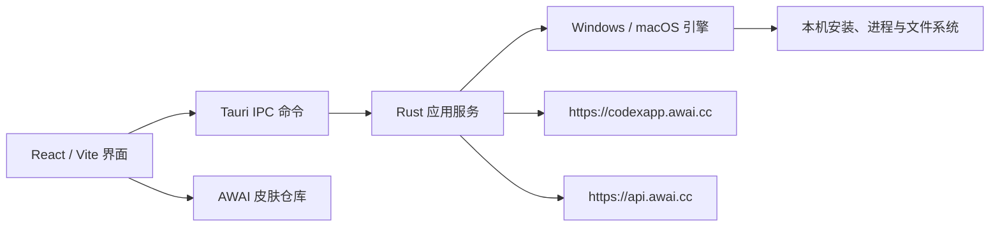

# AWAI Codex App Manager 架构

本文描述当前仓库中的真实边界。Manager 是本地 Tauri 应用；AWAI 镜像负责分发
官方 Codex 工件和 Manager 更新；AWAI API 与皮肤库是独立服务。

## 组件职责

### 前端

`src/` 提供安装状态、操作计划、配置管理、皮肤和关于页面。浏览器开发模式使用
同一套状态模型和 mock fallback，便于在 Windows 上先验证界面；真正的文件和进程
操作必须经过 Tauri 命令。

### Rust 命令层

`src-tauri/src/commands.rs` 是前端与本地服务之间的窄桥。命令层负责参数校验、
权限边界和错误映射，不把平台细节泄露到 React 组件。

### 应用服务与引擎

- 安装、更新、卸载服务先读取本机状态，再生成计划，确认后才执行破坏性操作。
- `codex-win-engine` 解析 AWAI Windows manifest，校验 SHA-256，并在 MSIX 与便携
  路径之间选择。
- `codex-mac-engine` 解析 Sparkle appcast，校验 EdDSA，优先应用 delta，失败时
  回退完整包，并在同一卷上替换和回滚。
- 配置服务只读写用户自己的 Codex 配置；API Key 写入本机凭据文件，不进入日志、
  皮肤包或镜像。

## 远程接口

| 用途 | 地址 | 信任与校验 |
| --- | --- | --- |
| Windows 当前版本 | `https://codexapp.awai.cc/latest/manifest` | HTTPS、manifest 字段校验、包 SHA-256、原生签名 |
| Windows 校验表 | `https://codexapp.awai.cc/latest/checksums` | 与下载文件逐字节比对 |
| macOS appcast | `https://codexapp.awai.cc/latest/appcast.xml` | Sparkle EdDSA、Apple Developer ID / 公证 |
| Manager 自更新 | `https://codexapp.awai.cc/manager/latest.json` | Tauri updater 签名 |
| AWAI API | `https://api.awai.cc/v1` | 用户 API Key；请求由用户主动配置 |
| 皮肤目录 | GitHub / Gitee `codex-app-manager-skins` | `.codexskin` 包 SHA-256 与格式校验 |

镜像只复制工件或重写下载 URL，不修改官方 Codex 包内部内容。镜像不可用时，应用
可使用配置的备用源；备用源不能绕过签名和哈希检查。

## 操作生命周期

1. 探测：读取已安装版本、来源、运行状态和平台能力。
2. 规划：根据 manifest、架构、校验和策略生成可读计划。
3. 确认：安装、更新、卸载和应用配置等有副作用的操作需要用户确认。
4. 暂存：下载到独立目录，限制大小，完成 SHA-256、包身份和原生签名校验。
5. 提交：停止相关进程后执行平台原子替换；失败时保留旧版本并回滚。
6. 记录：在安装包外保存 provenance、操作结果和可脱敏诊断信息。

## 安全边界

Manager 不修改 Codex 应用包、不破解 OpenAI 或 Microsoft 的授权、不把 API Key
上传到 AWAI 服务器，也不因为镜像下载而降低操作系统的签名验证要求。皮肤通过
运行时主题接口应用，不能替代或覆盖 Codex 的代码签名。

更多接口字段见 [`manifest-contract.md`](./manifest-contract.md)，发布约束见
[`release.md`](./release.md)。
