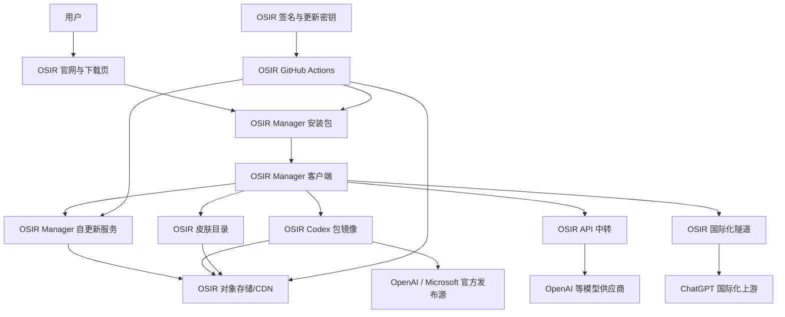

# Codex Manager 完整独立化评估（OSIR-owned）

评估日期：2026-08-17

## 1. 结论

把当前项目完整改成 OSIR 自有产品，不是“换品牌后重新打包”，而是一次完整的产品与基础设施迁移。完成后，所有用户可见入口、运行时服务、发布账号、安装包、更新密钥、对象存储、API、皮肤目录、国际化隧道、签名证书和监控都应由 OSIR 控制。

当前仓库中，与原品牌、账号、域名和外部镜像直接相关的内容分布在约 118 个文件。完整迁移必须同时覆盖代码、云端、发布流程和用户数据路径。

推荐客户端显示名：`Codex Manager`；所有权和发布归属由 OSIR 控制。

## 2. “全部是自己的”应如何定义

完整独立不等于所有服务器都必须物理自建，而是以下资源必须处于 OSIR 自己的账号、域名和密钥控制下：

- OSIR 自己的 GitHub 组织或账号仓库
- OSIR 自己的域名和 DNS
- OSIR 自己的 Cloudflare/R2/S3/VPS 账号
- OSIR 自己的 Manager 安装包
- OSIR 自己的 Tauri updater 私钥和公钥
- OSIR 自己的 Windows/macOS 签名身份
- OSIR 自己的 Codex 安装包采集、校验和镜像服务
- OSIR 自己的 API 中转、用户鉴权、额度和账单体系
- OSIR 自己的皮肤仓库、图片和包文件
- OSIR 自己的国际化隧道
- OSIR 自己的官网、下载页、隐私说明和发布记录
- OSIR 自己的日志、监控、备份和事故处理权限

OpenAI、Microsoft、Apple、GitHub、Cloudflare 等仍是外部供应商，但 OSIR 使用的是自己的账号和资源，不再依赖其他项目的账号或服务配置。

## 3. 推荐目标架构



## 4. 推荐域名规划

以下使用 `<osir-domain>` 作为待确认主域名：

| 域名 | 用途 | 推荐部署 |
|---|---|---|
| `codex.<osir-domain>` | 官网、产品介绍、下载入口 | Cloudflare Pages/Workers 或静态站点 |
| `download.<osir-domain>` | Manager 与 Codex 安装文件 | Cloudflare Worker + R2，必要时增加中国大陆对象存储 |
| `updates.<osir-domain>` | Manager `latest.json`、签名文件、版本化工件 | 与下载存储共用，但路径和权限隔离 |
| `api.<osir-domain>` | OSIR OpenAI-compatible API | OSIR VPS/Kubernetes/托管容器 |
| `skins.<osir-domain>` | 皮肤目录、预览图、`.codexskin` | R2/对象存储 + CDN |
| `relay.<osir-domain>` | 国际化 WebSocket 隧道 | OSIR VPS，限制单一上游和连接数 |
| `status.<osir-domain>` | 服务状态页 | 独立状态页服务 |

也可以使用一个域名按路径路由，但完整独立运营更适合按服务拆分，便于权限、缓存、监控和故障隔离。

## 5. 完整迁移清单

### 5.1 源码仓库与账号

目标：所有提交、Issue、Actions、Release 和发布审批都位于 OSIR 账号下。

需要完成：

- 创建 `ousir0/osir-codex-manager` 或 OSIR GitHub Organization 仓库
- 创建 `ousir0/osir-codex-manager-skins`
- 创建 Codex 包采集/镜像服务仓库
- 创建 API 中转服务仓库
- 创建官网仓库或保留当前 `website/` 子项目
- 将当前 `upstream` 仅作为历史来源，正式发布流程不再读取它
- 配置默认分支、PR 审批、MFA、tag ruleset、protected environment
- 将 GitHub Actions 中硬编码的发布账号、账号 ID、仓库名全部替换为 OSIR

重点文件：

- `.github/workflows/release.yml`
- `.github/workflows/release-source.yml`
- `.github/workflows/winget.yml`
- `.github/workflows/ci.yml`
- `scripts/check-release-tag-protection.mjs`
- `scripts/release-binding.mjs`
- `scripts/write-release-summary.mjs`

### 5.2 产品身份与品牌

目标：安装后在系统、任务管理器、安装器、关于页面、日志和更新记录中均显示 OSIR。

需要替换：

- 客户端显示名：`Codex Manager`
- 主二进制名：建议 `osir-codex-manager`
- macOS Bundle ID：建议 `com.osir.codexmanager`
- Windows 应用名称和安装目录
- Windows 卸载项名称和发布者
- 官网标题、描述、版权和下载文件名
- Logo、托盘图标、安装器图、DMG 图标
- AWAI 文案、API 名称、主题作者、主题 ID 前缀
- `awai-*` 内部命名；兼容旧数据时需要迁移映射
- `CodexAppManager_*` 工件名改为 `CodexManager_*`

重点文件：

- `src-tauri/tauri.conf.json`
- `src-tauri/Cargo.toml`
- `package.json`
- `src/app/i18n.tsx`
- `src/app/icons.tsx`
- `src/app/assets/`
- `src-tauri/icons/`
- `src-tauri/installer/`
- `assets/banner.svg`
- `website/`

影响：修改 Bundle ID 后，系统会把 OSIR 版视为新应用。旧设置、自动启动项和缓存不会自动继承，除非实现一次性数据迁移。

### 5.3 Manager 安装包与自更新信任链

目标：客户端只能接收 OSIR 发布和签名的 Manager 更新。

需要完成：

1. 生成新的 Tauri updater 密钥对。
2. 公钥写入 `src-tauri/tauri.conf.json`。
3. 私钥只保存于 OSIR GitHub protected environment 和离线备份。
4. 将 updater endpoint 改为 `updates.<osir-domain>/manager/latest.json`。
5. 修改 `gen-updater-manifest.mjs` 和 Release 工作流，使其生成 OSIR 工件名。
6. 在自己的对象存储中保存不可覆盖的版本目录。
7. 完成一次 `旧版 OSIR → 新版 OSIR` 的真实自更新测试。

必须替换的现有内容：

- 原 `latest.json` 地址
- 原 GitHub Release fallback
- 原 updater 公钥
- 原 R2/S3 bucket 和访问密钥
- 原 release binding、attestation、mirror promotion 配置

风险：只改更新地址但继续使用旧公钥会导致更新签名验证失败；继续使用旧私钥则不算独立信任链。

### 5.4 Windows Codex 包采集与镜像

目标：OSIR Manager 不再依赖现有 `/latest/manifest`、`checksums` 和 `win-*` 服务。

这是完整独立化中工作量最大、最容易被低估的一部分。当前仓库主要是“消费镜像”，并没有完整提供 Windows 官方包采集生产端。

OSIR 需要单独建设：

- Windows 官方 Codex 新版本探测任务
- Microsoft Store/MSIX 获取流程
- x64/ARM64 包识别
- 官方 Publisher、包身份和 Authenticode 校验
- SHA-256 生成
- `manifest` 和 `checksums` 生成
- 原始 MSIX 与便携包存储
- 版本化、不可覆盖发布
- 下载失败回滚和上一个稳定版本保留
- 定时探测与人工冻结开关
- Windows 安装、启动、升级、卸载冒烟测试

客户端接口可以继续沿用当前合同：

```text
/latest/manifest
/latest/checksums
/latest/win
/latest/win-x64
/latest/win-arm64
/latest/win-unpacked
```

这样客户端 Rust 代码改动较少，主要替换 base URL；但服务端采集和验证系统必须由 OSIR 新建。

### 5.5 macOS Codex 包采集与镜像

目标：OSIR 提供自己的 macOS appcast 和包文件。

需要完成：

- 定时读取 OpenAI 官方 `persistent.oaistatic.com` Appcast
- 下载 arm64/x64 完整包和增量包
- 验证 Sparkle EdDSA 签名
- 保留原始字节，不重新签署官方 Codex
- 将 enclosure URL 重写为 OSIR 下载域名
- 发布 OSIR `appcast.xml` 和 `appcast-x64.xml`
- 保留 OpenAI 官方源作为紧急回退，但默认使用 OSIR 镜像
- 测试完整包、delta、失败回退和版本比较

客户端重点文件：

- `src-tauri/src/app/mac_update.rs`
- `crates/codex-mac-engine/`

### 5.6 历史版本服务

目标：不再查询 `Wangnov/codex-app-mirror`。

需要完成：

- 将历史版本纳入 OSIR 自己的镜像数据库或 GitHub Releases
- 提供分页 Release API 或自己的 JSON 目录
- 修改 `src-tauri/src/app/release_install.rs` 中仓库和 API 常量
- 对已有历史资产重新记录 digest、架构、包格式和包身份
- 保留本地手动选择包的离线路径

### 5.7 OSIR API 中转

目标：`api.<osir-domain>/v1` 由 OSIR 独立运营。

完整功能至少需要：

- OpenAI-compatible Responses/Chat API
- `/v1/models`
- API Key 创建、停用、轮换
- 用户、套餐、余额、限流、并发控制
- 上游模型路由与故障切换
- 请求日志脱敏
- 账单与成本统计
- 滥用检测和封禁
- 生图 API Key 独立存储与转发
- HTTPS、WAF、速率限制和告警
- 隐私策略、数据保留周期和删除机制

客户端需要替换：

- `api.awai.cc` → `api.<osir-domain>`
- provider id `awai` → `osir`
- provider name → `OSIR`
- 浏览器 mock、测试、配置迁移和多语言文案

如果 OSIR 不准备运营 API 中转，则应彻底删除该预设，只保留 OpenAI 官方和用户自定义 Base URL；“继续展示但没有后端”不属于完整迁移。

### 5.8 OSIR 皮肤服务

目标：主题目录、预览图和皮肤包全部由 OSIR 发布。

需要完成：

- 创建 OSIR 皮肤仓库或对象存储目录
- 迁移/重新制作主题包、预览图、描述和分类
- publisher id 改为 `osir`
- 主题 ID 从 `awai-*` 改为 `osir-*`
- 生成 `index.json`、SHA-256 和包大小
- 提供主源和备用源
- 修改前端 Vite 代理和 Rust allowlist
- 实测下载、预览、导入、更新和损坏包拒绝

重点文件：

- `src-tauri/src/app/codex_theme.rs`
- `src/services/managerApi.ts`
- `vite.config.ts`
- `scripts/build-dream-skins-from-wallpapers.mjs`

### 5.9 OSIR 国际化隧道

目标：WebSocket 入口、服务器、日志和限流均由 OSIR 控制。

需要完成：

- 部署 `relay.<osir-domain>/i18n-tunnel`
- 在 OSIR VPS 上运行 WebSocket-to-TCP 服务
- 仅允许 `ab.chatgpt.com:443`
- 限制连接数、时长和字节数
- 保持端到端 TLS，不做内容解密
- 修改客户端 PAC、线程名、日志、服务文件和域名
- 增加健康检查、连接数监控和自动重启

重点文件：

- `crates/codex-win-engine/src/i18n_proxy.rs`
- `crates/codex-win-engine/src/sys.rs`
- `deploy/awai-i18n-relay/`
- `deploy/download-server/Caddyfile`

### 5.10 官网与下载页

目标：OSIR 用户只看到 OSIR 品牌和 OSIR 下载链接。

需要完成：

- 重新设计 OSIR 产品主页
- OSIR Logo、视觉系统、文案和截图
- Windows/macOS 下载按钮
- 版本、SHA-256、签名状态展示
- 安装说明和系统要求
- 隐私说明、服务状态和问题反馈
- GitHub、皮肤库和 API 文档链接
- SEO、Open Graph、favicon、canonical URL
- 网站部署到 OSIR Cloudflare/Pages 账号

重点目录：`website/`。

### 5.11 Windows 签名与发布

目标：Windows 显示 OSIR 发布者，并建立 SmartScreen 信誉。

需要完成：

- 获取 OSIR 代码签名证书或接入 OSIR 自己的签名服务
- 签名主程序、卸载器和 NSIS 安装器
- 使用可信 RFC3161 时间戳
- 验证签名发行者、证书链和时间戳
- 更新 GitHub Secrets 与 `sign-windows-authenticode.ps1`
- 将 Winget ID 改为 OSIR 自有 ID，例如 `OSIR.CodexManager`
- 建立正式安装、升级和卸载测试

没有 Windows 证书也可以发布测试包，但不能把它视为完整生产迁移。

### 5.12 macOS 签名与公证

目标：DMG/App 由 OSIR Apple Developer 身份签名和公证。

需要完成：

- OSIR Apple Developer Team
- Developer ID Application 证书
- App Store Connect API Key
- hardened runtime 和 entitlements
- 内到外签名、notarization、staple
- Apple Silicon/Intel 双架构验证
- GitHub protected environment 中保存证书和密钥

### 5.13 云存储、CDN 与下载分流

推荐生产结构：

- Cloudflare R2：全球主对象存储
- Cloudflare Worker：`latest` 重写、缓存、地域路由、健康探测
- OSIR 自己的中国大陆对象存储：可选的国内加速分支
- OSIR VPS：API 和国际化隧道，不承担大型安装包主下载
- GitHub Releases：公开审计与备用下载源

需要在 OSIR 账号中重新创建：

- Cloudflare Zone 和 DNS
- Worker route
- R2 bucket
- S3 API Token
- 国内对象存储 bucket 和密钥
- GitHub Actions mirror promotion secrets
- 版本化不可覆盖策略
- `latest.json` 条件写入和回读校验

现有 Cloudflare zone ID、R2 endpoint、bucket 和 S3 变量不能继续使用。

### 5.14 日志、监控与运维

完整产品还需要补齐：

- 官网、下载、API、镜像和隧道可用性监控
- Manager 版本和 `latest.json` 一致性监控
- 安装包 SHA-256 定时复核
- R2/S3/GitHub Release 字节一致性检查
- API 成本、失败率、延迟和额度告警
- VPS CPU、内存、磁盘、连接数和证书到期告警
- 密钥轮换、离线备份和灾难恢复
- 发布回滚和停止 `latest` 指针的应急流程

## 6. 需要新建的 OSIR 资源

| 分类 | 必需资源 |
|---|---|
| 域名 | OSIR 主域名及 DNS 控制权 |
| GitHub | Manager、皮肤、包采集、API、官网仓库 |
| Cloudflare | Zone、Workers、R2、API Token |
| VPS | API 中转、国际化隧道、管理后台 |
| 对象存储 | Manager 工件、Codex 包、皮肤包、官网静态资源 |
| Apple | Developer Team、证书、公证 API Key |
| Windows | 代码签名证书和时间戳服务 |
| 更新签名 | OSIR Tauri updater 密钥对 |
| API 上游 | OSIR 自己的模型供应商账户、额度和结算 |
| 监控 | 状态页、日志、告警和备份 |

## 7. Secrets 清单

以下内容必须由 OSIR 重新生成，不能复用现有值：

- `TAURI_SIGNING_PRIVATE_KEY`
- `TAURI_SIGNING_PRIVATE_KEY_PASSWORD`
- `APPLE_CERTIFICATE`
- `APPLE_CERTIFICATE_PASSWORD`
- `APPLE_SIGNING_IDENTITY`
- `AC_API_KEY_ID`
- `AC_API_ISSUER_ID`
- `AC_API_KEY_BASE64`
- `WINDOWS_CERTIFICATE`
- `WINDOWS_CERTIFICATE_PASSWORD`
- `WINDOWS_TIMESTAMP_URL`
- R2/S3 access key 与 secret
- Cloudflare API Token
- GitHub Release/Ruleset token
- API 中转上游密钥
- API 用户鉴权签名密钥
- 监控和告警 webhook

## 8. 推荐实施阶段

### 阶段 0：冻结和设计

- 冻结当前代码快照
- 确定 OSIR 正式名称、域名、账号和云厂商
- 确定是否保留全部功能
- 输出最终 `SPEC.md` 和验收标准

### 阶段 1：产品身份迁移

- 修改品牌、Bundle ID、二进制名、图标和多语言
- 新建 OSIR 仓库和分支保护
- 清理约 118 个文件中的旧标识
- 加入旧配置到 OSIR 配置的迁移逻辑

### 阶段 2：独立构建与签名

- 重新配置 CI
- 生成 updater 密钥
- 配置 Windows/macOS 签名
- 产出首个 OSIR 安装包

### 阶段 3：Manager 自更新与对象存储

- 创建 OSIR R2/S3
- 部署 Worker 和下载域名
- 生成 OSIR `latest.json`
- 完成 OSIR 自更新闭环

### 阶段 4：Codex 包镜像

- 新建 Windows 包采集器
- 新建 macOS appcast 镜像器
- 生成 OSIR manifest/checksums
- 完成四个平台和架构验证

### 阶段 5：API、皮肤与国际化

- 部署 OSIR API
- 发布 OSIR 皮肤目录
- 部署 OSIR 国际化隧道
- 替换客户端所有运行时地址

### 阶段 6：官网与正式发布

- 发布 OSIR 官网
- 公布签名、SHA-256 和版本信息
- 进行 Windows/macOS 新装、升级、回滚和卸载验收
- 开启状态页和监控

## 9. 完整验收标准

完整迁移完成时，应同时满足：

1. 全仓搜索旧品牌、旧账号、旧域名、旧 Bundle ID 和外部镜像仓库，不再出现运行时代码引用。
2. 所有 OSIR 安装包由 OSIR CI 构建。
3. Manager 自更新只接受 OSIR updater 私钥签名。
4. Windows Codex 安装和更新只访问 OSIR manifest/checksums/package 服务。
5. macOS 默认只访问 OSIR appcast/package 服务，官方源只作为明确回退。
6. 历史版本只查询 OSIR 目录。
7. API 预设只指向 OSIR API。
8. 在线皮肤只访问 OSIR 皮肤源。
9. 国际化隧道只访问 OSIR 域名。
10. 官网、下载链接、隐私说明和反馈入口全部属于 OSIR。
11. Windows 安装器验证为 OSIR 发布者；macOS 通过 OSIR Developer ID 和公证验证。
12. 从空白 Windows/macOS 环境完成安装、启动、更新、主题、API、卸载全流程。
13. 使用网络抓包验证客户端不再访问旧服务。
14. GitHub Release、R2、备用存储和 `latest.json` 的 SHA-256 完全一致。
15. 任一外部发布账号不可触发 OSIR 发布或更新。

建议的仓库检查命令：

```bash
rg -n -i 'awai|qq501987847|qq501987849|codexapp\.awai\.cc|api\.awai\.cc|Wangnov/codex-app-mirror|cc\.awai' .
npm run check
npm run lint
npm test
cargo test --manifest-path src-tauri/Cargo.toml --lib
npm run tauri:build
```

旧标识检查允许保留在专门的迁移测试夹具或历史说明中，但不得出现在生产运行路径、默认配置和发布工件中。

## 10. 主要风险

| 风险 | 影响 |
|---|---|
| Windows 官方包采集能力缺失 | 无法实现真正独立的 Windows 安装和更新 |
| 更新密钥管理不当 | 客户端无法更新，或更新信任链失控 |
| 修改 Bundle ID 未做数据迁移 | 用户设置、主题和自动启动项丢失 |
| 未取得 Windows/macOS 签名身份 | SmartScreen/Gatekeeper 阻止或警告用户 |
| API 中转缺少额度和滥用控制 | 产生不可控成本和服务风险 |
| 大文件继续放 VPS | 下载速度、带宽和单点故障不可控 |
| 多镜像文件不一致 | 用户下载到不同字节，签名和校验失败 |
| 批量字符串替换 | 破坏兼容逻辑、测试夹具、主题 ID 和升级路径 |

## 11. 工作量判断

这是一个多仓库、多平台、多云资源项目，主要工作不是 React 页面，而是：

1. Windows Codex 包采集与验证系统。
2. Manager 自更新签名和发布供应链。
3. Windows/macOS 原生代码签名。
4. API 中转的账户、额度和运维体系。
5. 全仓品牌和兼容数据迁移。

前端换品牌只是其中较小的一部分。完整方案应按独立产品立项，而不是作为一次普通 UI 修改。

## 12. 尚待确认的产品决策

在把本评估编译成可执行 `SPEC.md` 和 `GOAL.md` 前，需要确认：

- OSIR 使用的正式主域名
- GitHub 使用个人账号还是 OSIR Organization
- API 中转是否必须保留完整功能
- 是否同时发布 Windows x64、Windows ARM64、macOS arm64、macOS x64
- 中国大陆下载是否需要单独对象存储和备案域名
- 新应用是否迁移旧应用设置，还是作为全新产品安装
